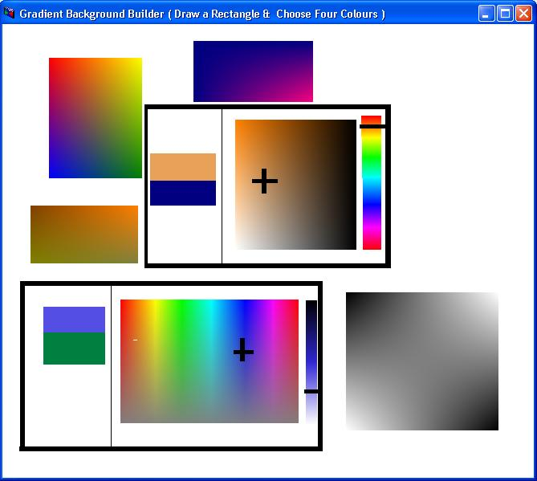

<div align="center">

## A New Type Of Gradient \! \(Updated\)


</div>

### Description

You can after now draw your gradients easily.

Select 4 Colors and draw a 4-colored gradient rectangle, you will see a new type of gradient you have never seen it before, you can use it for gradient color pallets (for example), i wrote a very little amount of code, to do this.

in addition, i have wrote an extra code that i hadn't use it, you can use it in your gradphics programs, like triangular gradient, and polygonal gradient
 
### More Info
 


<span>             |<span>
---                |---
**Submitted On**   |2009-07-05 12:08:16
**By**             |[Saed abumokh](https://github.com/Planet-Source-Code/PSCIndex/blob/master/ByAuthor/saed-abumokh.md)
**Level**          |Intermediate
**User Rating**    |5.0 (25 globes from 5 users)
**Compatibility**  |VB 6\.0
**Category**       |[Graphics](https://github.com/Planet-Source-Code/PSCIndex/blob/master/ByCategory/graphics__1-46.md)
**World**          |[Visual Basic](https://github.com/Planet-Source-Code/PSCIndex/blob/master/ByWorld/visual-basic.md)
**Archive File**   |[A\_New\_Type2157187102009\.zip](https://github.com/Planet-Source-Code/saed-abumokh-a-new-type-of-gradient-updated__1-72259/archive/master.zip)

### API Declarations

```
Public Const GRADIENT_FILL_RECT_H As Long = &amp;H0
Public Const GRADIENT_FILL_RECT_V As Long = &amp;H1
Public Const GRADIENT_FILL_TRIANGLE As Long = &amp;H2
Public Type TRIVERTEX
 X As Long
 Y As Long
 Red As Integer
 Green As Integer
 Blue As Integer
 Alpha As Integer
End Type
Public Type GRADIENT_TRIANGLE
 Vertex1 As Long
 Vertex2 As Long
 Vertex3 As Long
End Type
Public Type GRADIENT_RECT
 UpperLeft As Long
 LowerRight As Long
End Type
Public Declare Function GradientFill Lib "msimg32" (ByVal hDC As Long, pVertex As Any, ByVal dwNumVertex As Long, pMesh As Any, ByVal dwNumMesh As Long, ByVal dwMode As Long) As Long
```


